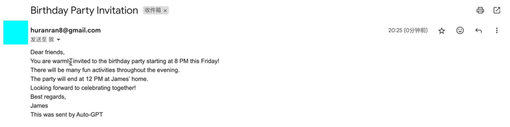
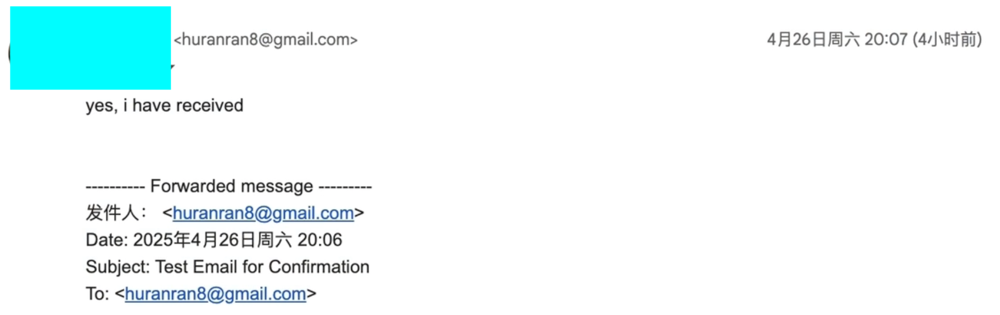

# ✉️ Auto-GPT Email Agent

A prototype **AI-powered autonomous agent** that simulates reading emails, making decisions, and replying using **LLMs (Large Language Models)**. Built with the framework inspired by [Auto-GPT](https://github.com/Torantulino/Auto-GPT), this project explores how **OpenAI's GPT** can automate multi-step tasks.

---

## 🔍 Project Highlights

- ✅ **LLM-Driven Agent**: Integrates OpenAI GPT to process email content and generate appropriate responses autonomously.
- ✅ **Goal-Oriented Workflow**: Simulates decision-making loop like Auto-GPT to process goals and subgoals.
- ✅ **Prompt Engineering**: Fine-tuned prompts to guide GPT output format and tone.
- ✅ **Expandable Architecture**: Structured for future integration with real email clients or APIs.

---

## 🧠 Keywords

> These improve discoverability and relevance for LLM-based AI roles:

- `Large Language Model (LLM)`
- `OpenAI API Integration`
- `Autonomous Agent`
- `Auto-GPT`
- `Prompt Engineering`
- `AI Email Assistant`
- `LangChain-compatible architecture (potential)`

---

## 🛠️ Tech Stack

- Python 3.11  
- OpenAI GPT-4 / GPT-3.5 (via API)  
- Auto-GPT architecture (simplified)  
- Terminal CLI interface  
- Modular agent loop logic  

---

## 📁 Project Structure

```bash
.
├── main.py             # Core agent execution loop
├── tasks.py            # Task handling logic
├── prompts/            # Prompt templates used for GPT communication
├── data/               # Sample email content
├── responses/          # Generated responses
├── .gitattributes
├── README.md
```

## ▶️ Demo
📸 
📸 

## 🚀 How to Run

### Install dependencies
pip install -r requirements.txt

### Set your OpenAI API key
export OPENAI_API_KEY=your_key_here

### Run the agent
python main.py


## 💡 Future Improvements
Integrate with real Gmail/Outlook API

Add memory persistence between runs

Incorporate vector search using FAISS for context retention

Convert to LangChain agent for more robust planning

## 📌 Author
Ranran Hu 

M.S. in Computer Science @ UMass Dartmouth

Email: huranran8@gmail.com


## 🎬 Project Demonstration Video

You can download and view the full setup and testing process in the video below:

 HEAD
👉 [📥 Click here to download the demo video](./Video_Recording.mov)
